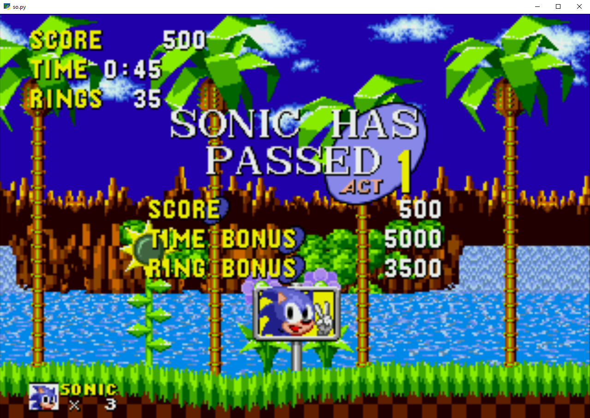

## OpenAI Retro Gym

Przy okazji konkursu 
https://blog.openai.com/retro-contest/  
dowiedziałem się o zbudowanym przez OpenAI wrapperze na gry Nintendo,  
pozwalającym stworzyć środowisko do Reinforcement Learningu.  

Postanowiłem na jego podstawie nauczyć się czegoś o tej dziedzinie.  
Zaadoptowałem do swoich potrzeb znalezione w Internecie implementacje  
dwóch podejść do uczenia maszynowego w grach: Deep Q Network i Policy Gradient,  
odpowiednio w Kerasie i TF.  

#### Główne problemy
1. Zrozumienie algorytmów DQN i Policy Gradient
2. Dostosowanie implementacji do potrzeb retro gym
3. Obejście problemów ze skryptem generującym nagrody, dostarczanym przez OpenAI

##### Policy Gradient - Tensorflow
Użyłem implementacji z https://github.com/yukezhu/tensorflow-reinforce  
Algorytm był dostosowany do jednowymiarowych inputów i prostej sieci neuronowej.  
Dostosowałem go do CNN na dwuwymiarowych obrazach.

##### Deep Q Network - Keras
Zbudowana na podstawie impelemtacji z Internetu,  
również przerobiona do dwuwymiarowego inputu i sieci konwolucyjnej.  
Ta implementacja osiąga bardziej widoczne efekty,  
co raczej nie dziwi, jest o wiele prostsza niż niskopoziomowy TF.

Efekt nie jest spektakularny, ale sieci działają, czegoś się uczą,  
a kilka razy nawet udało im się ukończyć poziom.  

